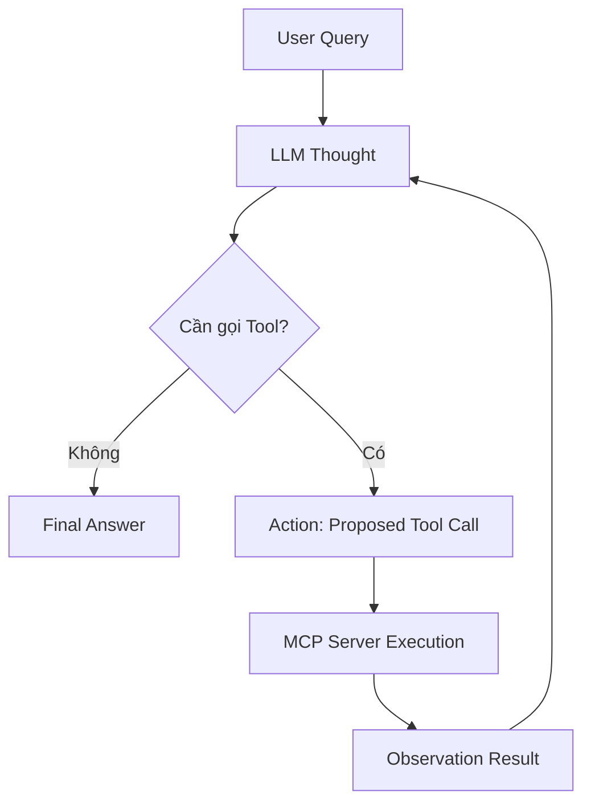

# 🎓 BÀI LAB 3: CHATBOT VS REACT AGENT — TỪ LÝ THUYẾT ĐẾN THỰC THI (MCP ENHANCED)

Bài thực hành giúp học viên chuyển đổi tư duy từ viết Chatbot đơn thuần sang phát triển hệ thống **ReAct Agent** thông minh, ứng dụng giao thức **Model Context Protocol (MCP)** để kết nối dữ liệu và công cụ thực tế.

> 💡 **Mục tiêu đầu ra của Bài Lab:**  
> Sau khi hoàn thành bài Lab 180 phút, học viên sẽ nộp một sản phẩm cá nhân hoàn chỉnh: mã nguồn Agent chạy mượt mà ReAct Loop & Native Tool Calling, kết nối MCP Server và trích xuất file Waterfall Trace Log chuẩn hóa.

📦 **Starter Repositories Bài Lab 3 (Fork về làm bài):**  
- ☀️ **Lớp Sáng (K4A):** [VinUni-AI20k/K4A-Day03-Lab-Chatbot-vs-ReAct-Agent-MCP](https://github.com/VinUni-AI20k/K4A-Day03-Lab-Chatbot-vs-ReAct-Agent-MCP)  
- 🌙 **Lớp Chiều (K4B):** [VinUni-AI20k/K4B-Day03-Lab-Chatbot-vs-ReAct-Agent-MCP](https://github.com/VinUni-AI20k/K4B-Day03-Lab-Chatbot-vs-ReAct-Agent-MCP)  

---

## 📋 THÔNG TIN BRIEF & BỐI CẢNH LÝ THUYẾT

- **Mục tiêu:** Xây dựng ReAct Agent kết nối MCP Server, thực thi vòng lặp suy luận Thought -> Action -> Observation và xuất vết Waterfall Trace Log.
- **Người học / Day / Thời lượng:** Học viên Khóa 4 / Ngày 03 / 180 phút làm bài (Buổi học 240 phút - 4 tiếng).
- **Hình thức:** Cá nhân làm bài 100% (`workMode: "individual"`).
- **Deliverable và cách kiểm tra:** Fork repo đúng ca học về GitHub cá nhân và kiểm tra qua file log `docs/trace_waterfall.json` cùng mã nguồn Python `src/`.

### 💡 Khung Nền tảng Lý thuyết (4 Cấp độ AI System)

| Cấp độ | Loại hệ thống | Đặc điểm kỹ thuật cốt lõi | Sự xuất hiện trong Bài Lab |
| :---: | :--- | :--- | :--- |
| **Cấp 1** | **Rule-Based Bot** | Khớp từ khóa `if/else` cố định, không có LLM | Reference |
| **Cấp 2** | **LLM Chatbot** | Dùng LLM sinh text mượt, không gọi được Tool | Baseline |
| **Cấp 3** | **ReAct Agent (MCP-Enhanced)** | Vòng lặp ReAct `Thought -> Action -> Observation` | **Trọng tâm Bài Lab** |
| **Cấp 4** | **Autonomous Agent** | Tự rã mục tiêu, Memory/Planning | Mở rộng |

---

## 1. CHUẨN BỊ MÔI TRƯỜNG & FORK REPO

```powershell
python -m venv .venv
.venv\Scripts\Activate.ps1
pip install -r requirements.txt
Copy-Item .env.example .env
Copy-Item config\test_cases.example.json config\test_cases.json
```

- [x] Đã Fork/chuẩn bị repo cá nhân.
- [x] Đã kích hoạt môi trường ảo và cài dependencies.
- [x] Đã tạo `config/test_cases.json`.

---

## 2. TASK 1.1 — ĐÁNH GIÁ AGENTIC FIT

Điền bảng Scoring Matrix trong `docs/trace_eval.md` theo 4 tiêu chí:

- Multi-step Reasoning
- Tool Interaction
- Dynamic Decision
- Long Horizon Goal

File `config/test_cases.json` phải có đủ 5 test case, không còn TODO.

---

## 3. TASK 1.2 — KHAI BÁO TOOL SPECS

Mô hình LLM hiểu công cụ thông qua JSON Schema. Trong project này, MCP SDK sinh schema từ Python type hints/docstrings của các hàm tool:

- `calendar_list_events`
- `calendar_create_event`
- `calendar_update_event`
- `calendar_delete_event`

---

## 4. TASK 2.1 — KẾT NỐI MCP SERVER

MCP là tiêu chuẩn mở kết nối Agentic Systems với nguồn dữ liệu/công cụ bên ngoài. Trong project này, MCP Server thật chạy độc lập qua stdio subprocess.

Kiểm tra:

```powershell
python src/app.py --mcp-smoke
```

Kỳ vọng thấy MCP Client kết nối thành công và các Calendar tools được công bố.

---

## 5. TASK 2.2 — REACT LOOP & NATIVE TOOL CALLING

Luồng chính:



`src/app.py` thực hiện vòng lặp cho đến khi có final answer hoặc vượt `MAX_ITERATIONS`.

---

## 6. TASK 3.1 — TEST SUITE & WATERFALL TRACE

### Cấu hình API thật

Mở `.env` và điền API key thật. Project hỗ trợ Groq/OpenAI-compatible provider.

### Chạy 5 test cases

```powershell
python src/app.py --all
```

Với Google Calendar thật, để an toàn nên dùng `--interactive`; `--all` mặc định bị chặn nếu `ALLOW_GOOGLE_WRITE_TESTS=false`.

### Interactive

```powershell
python src/app.py --interactive
```

Sau khi chạy, kiểm tra:

- `docs/trace_waterfall.json`
- `docs/trace_eval.md`

---

## 7. TASK 3.2 — ĐÓNG GÓI REPO & NỘP BÀI

```bash
git add .
git commit -m "feat: complete Day 03 Lab Chatbot vs ReAct Agent"
git push origin main
```

Đảm bảo repo có đủ:

- `src/`
- `config/test_cases.json`
- `docs/trace_waterfall.json`
- `docs/trace_eval.md`

Không commit `.env`, `credentials.json`, `token.json`, `.venv/`.

---

## 8. FAQ

- `ModuleNotFoundError`: kiểm tra virtualenv và `pip install -r requirements.txt`.
- PowerShell ExecutionPolicy: dùng `Set-ExecutionPolicy -ExecutionPolicy RemoteSigned -Scope CurrentUser` nếu cần.
- Không có trace: đảm bảo chạy lệnh từ root project.

---

## 💯 9. THANG ĐIỂM ĐÁNH GIÁ

| Tiêu chí | Trọng số | Bằng chứng kiểm tra |
| :--- | :---: | :--- |
| **Agentic Fit & Tool Specs** | **25%** | `docs/trace_eval.md` + `config/test_cases.json` |
| **ReAct Loop & MCP Integration** | **35%** | `src/mcp_server.py` + `src/tools.py` + `src/app.py` + log API thật |
| **Waterfall Trace & Observation** | **25%** | `docs/trace_waterfall.json` + `docs/trace_eval.md` |
| **Git Repository & Submission** | **15%** | Link repo GitHub cá nhân |
